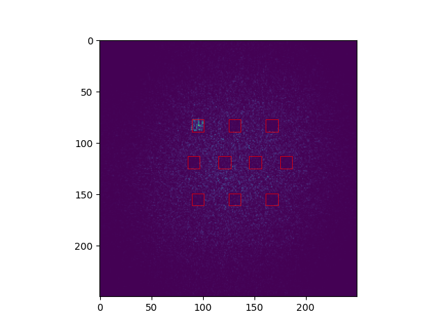
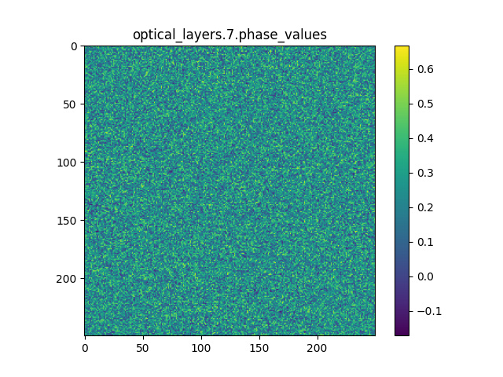
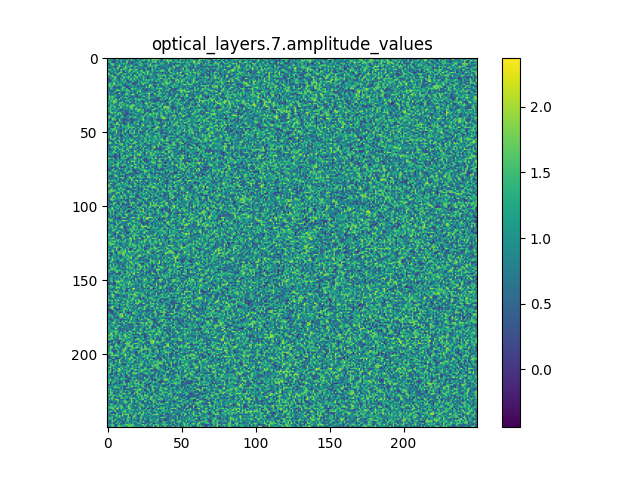
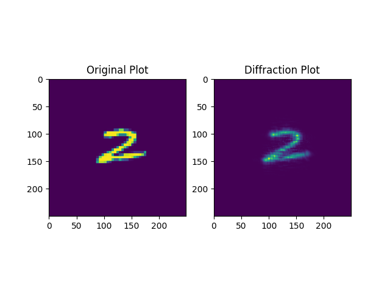
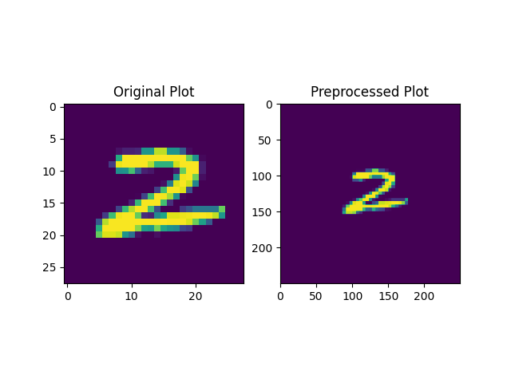
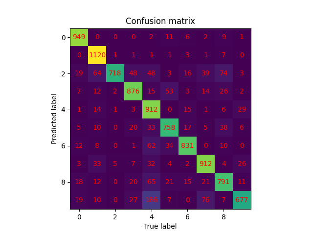
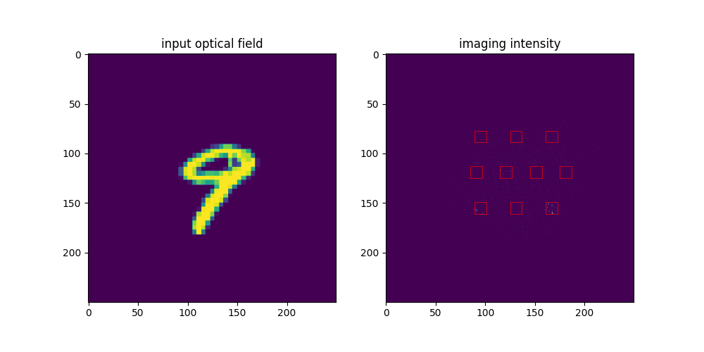
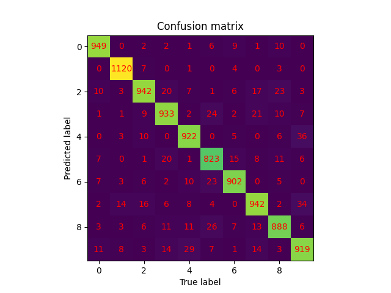
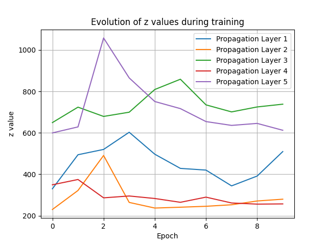
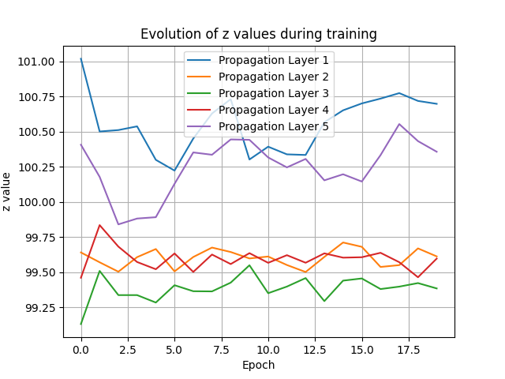

# 全光神经网络仿真

作者： 冯子嘉 2022012887

日期：2023.8.13

## 运行须知


文件说明：

本项目实现了全光神经网络的仿真，在 MNIST 上最高达到了 97% 的正确率（当然是加了一个现实中根本不可能实现的非线性）

train 文件夹用于训练，predict 用于预测。

本文档中详述了原理及实现过程，建议先阅读项目文档再点进 train 与 predict 文件夹。项目文档中涉及的源代码主要蕴含在 train 文件夹中。

train 与 predict 文件夹内均有 README.txt 文件，建议查看后运行文件。

literature 是本项目的参考文献，可以对照项目文档最后的 reference 查看。

如果需要预处理完成之后的数据，可以联系作者。


## 项目简介

经典神经网络的架构人们已经耳熟能详。神经网络多基于GPU平台进行训练和推断。在Lin etc.的论文中，他们提出了一种基于光的衍射与相位调制的新型神经网络架构 $D^2NN$ (Deep Diffractive Neural Network)。[<sup>1</sup>](#reference) 全光神经网络在推断任务（Inference task）中具有**低能耗、近光速**的独特优势。[<sup>3</sup>](#reference)

本项目使用 `Python + Pytorch` 对全光神经网络进行仿真，并应用于MNIST手写数字识别中，通过调参取得了 $93.5\%$ 的正确率，高于原始论文 $91.75\%$ 的结果。本项目继续探索了对模型架构的改进方法，在引入相关改进后取得了 $96.5\%$ 的仿真正确率。

本项目主要参考论文 [All-optical machine learning using diffractive deep neural networks](https://www.science.org/doi/10.1126/science.aat8084)。预处理及训练代码请参考 source 文件夹中的内容，预测请参考 model 文件夹中的内容。

## 基本原理

该网络的基本架构由三种 `layer` 组成，分别为：主管光波的空间自由传播的传播层 `propagation_layer`、进行光的相位与振幅调制的调制层 `modulation_layer`、以及最终实现预测的成像层 `imaging_layer`。

训练过程分为前向传播与反向传播，推断过程前向传播即可完成。

### 前向传播

在前向传播中，该网络完整地模拟了光的物理传播过程。

首先由一束相干光打入镂空的数字获得入射光场(input plane)，接下来光在自由空间中传播，由菲涅尔衍射决定。在光传播的等间隔处加入了相位与振幅调制片(L1, L2...)。最后的成像屏中有十个方块，每个代表一个数字，squares中所获光强最大的一个即为全光神经网络的预测结果。

架构在下图中展现[<sup>1</sup>](#paper) ：


最终实现的效果如下所示。

|  |  |
|:---:|:---:|
| 入射光场分布 | 成像光强分布 |

可以看到第一个square中的光强明显大于其余几个方块，因此0即为该神经网络的预测结果。

### 反向传播

`modulation_layer` 中的相位与振幅调制片是网络中唯一的learnable parameter, 它们控制着光的传播。其更新使用梯度下降法完成。最终的调制片示例如下：

|  |  |
|:---:|:---:|
| 相位调制 | 振幅调制 |

## 环境配置

使用vscode ssh连接精仪科协服务器进行训练。

软件环境: `torch '2.0.1+cu117' + numpy '1.23.5'`

硬件环境: `NVIDIA GeForce RTX 3090`（精仪科协服务器）

数据集: MNIST 手写数字识别

## 代码实现

### OpticalNetwork

本部分的相关代码在 `train.py`, `onn_am.py`, `layer_show.py`中。第一个代码是训练的核心代码，第二个代码只含有optical network，第三个代码展示了传播层和调制层的工作。

作者自己写的 `OpticalNetwork` 类继承自 `torch.nn`。其实现可以单独参照 [onn_am.py](./support_images/onn_am.py)。类中有三种层：传播层 `propagation_layer`、调制层 `modulation_layer` 和成像层 `imaging_layer`。

`propagation_layer` 模拟光在自由空间中传播一段距离 z 前后的光场变化。作者采用菲涅尔传递函数 (Transmittive Funtion, TF) 法，参照 [Computational Fourier Optics](https://www.spiedigitallibrary.org/ebooks/TT/Computational-Fourier-Optics-A-MATLAB-Tutorial/eISBN-9780819482051/10.1117/3.858456?SSO=1) 的实现完成 `propTF()` 函数。经过一个传播层的结果如下所示。



可以看到自由空间传播的卷积效果对图象造成了一定模糊。

菲涅尔传递函数方法可以用角谱法在傍轴近似下保留二阶小量得到。其原理详见 [Goodman: Introduction to Fourier Optics, Edition 4th](https://www.semanticscholar.org/paper/Introduction-to-Fourier-optics-Goodman/5e3eb22c476b889eecbb380d012231d819edf156)。其实现详见训练所用代码 `train.py`。

`modulation_layer` 主要引入相位和振幅调制片。调制片与采样空间有着同样的 size。作为唯一可调参数的layer，在定义完各个层之后，相位与振幅调制的参数可以直接调用 `loss.backward()` 完成计算，使用 `optimizer.step()` 完成更新。

以下是进行随机相位调制之后再传播 $z$ 距离的光强分布。


`imaging_layer` 完成成像和输出的任务。在计算总的光强后，`imaging_layer` 会对每一个方块中的光强大小进行统计并进行归一化，输出一个 dim = 10 的tensor，光强最大的即为预测结果。

举例而言，在下右图中，其对应的tensor为：

```
0.1584, 0.1126, 0.1083, 0.1370, 0.1285, 0.8973, 0.1393, 0.1145, 0.2016, 0.1920
```

可以明显看到 `tensor[5]` 的数值最大，因而5就是我们的预测结果。

 

需要特别注意的是：`imaging_layer` 中归一化操作不能就地完成，否则梯度计算会出错，需要新定义一个 `value_` 数组再return。

最终的模型由

$\rm 5 \times propagation\_layer + 5 \times modulation\_layer + imaging\_layer$

组成。

模型的损失函数使用 `MSELoss()`，参数初始化方法选择 `kaiming_uniform_` 或`uniform_`，优化器选用 `Adam`。

### Parameters

这里是固定参数，此处只列出参数及其代表的含义，其选择原因见"参数的选择原因"

光学参数

```
M = N = 250     # sampling count on each axis
lmbda = 0.5e-6  # wavelength of coherent light
L = 0.2         # the area to be illuminated
w = 0.051       # the half-width of the light transmission area
z = 100         # the propagation distance in free space
```

在使用全部MNIST数据进行训练时的神经网络参数为：

```
learning_rate = 0.003
epochs = 6
batch_size = 128
```

### 数据预处理

预处理的相关代码在 `prepro.py`以及 `prepro_label.py` 中。其核心在于将图片重新采样，将其大小限制在 $(2w) \times (2w)$ 并嵌套在一个 $L \times L$ 的方形区域内。这样生成所有图片都是 $M \times M$ ，入射光场的形状得以统一。前后对比如下所示。



label的预处理在于把一个数字扩展成一个 dim = 10 的数组。若label = $i$, 则生成单位向量 $e_{i+1}$。

预处理完成后保存为npy文件，便于在不同设备上的转移与读取。

### 数据读取

小批量数据的读取可以直接通过 `np.load()` 完成，但MNIST的训练数据超出了GPU内存的限制，必须通过dataloader完成。具体代码参照 `train.py` or `train_am.py`。

## 模型表现及分析

### 训练表现

以下结果是没有加入振幅调制，只有振幅调制的结果。加入振幅调制的结果将在下一板块"模型调优"进行讨论。

笔者一开始使用MNIST的前 $2\%$ 进行训练与测试，也即 $ \rm 1000 \times train + 200 \times validation + 200 \times test$。

若使用参数

```
learning_rate = 0.003
epochs = 20
batch_size = 128
```

一次训练及测试所需的时间大约为50s，方便调参。以下是其中一次的输出结果，其权重保存到了`weights_small.pt`中

```
Using cuda device
Epoch [1/20], Training Loss: 0.1198, Training Accuracy: 70.10%, 
...
Epoch [20/20], Training Loss: 0.0255, Training Accuracy: 95.90%, 
Validation Loss: 0.0397, Validation Accuracy: 87.50%
Test Accuracy: 90.50%
```

在小批次数据集上，笔者在测试集上最高达到过92.5%的正确率。平均正确率约为 $91\%$

笔者后来使用MNIST的全部进行训练与测试，也即 $ \rm 50000 \times train + 10000 \times validation + 10000 \times test$。使用参数

```
learning_rate = 0.003
epochs = 6
batch_size = 128
```

一次训练及测试的结果大约为40min。以下是一次输出的结果，其权重保存到了`weights_large.pt`中。
```
Epoch [6/6], Training Loss: 0.0243, Training Accuracy: 92.86%, 
Validation Loss: 0.0225, Validation Accuracy: 93.64%
Test Accuracy: 92.65%
```

在大批次数据集上的结果，validation set中的正确率超过 $93.5%$, test set中正确率也超过了 $92.5\%$ 。不加入振幅调制，原始论文的仿真结果为 $91.75\%$。结果相近。

我们列出大批量数据和小批量数据的 `confusion_matrix` 以作对比。

|大批量数据|小批量数据|
|--|--|
|||

### 结果展示

我们通过列出模型归一化之后的输出结果 `output` && 入射光场与最终成像光强的对比展示模型的预测表现。

+ 若没有振幅调制

```
[[0.1320, 0.1467, 0.2757, 0.6138, 0.3394, 0.4097, 0.3318, 0.1327, 0.2697, 0.1574]]
```


```
[[0.0817, 0.1322, 0.1069, 0.3428, 0.1222, 0.1302, 0.0683, 0.0961, 0.8899, 0.0956]]
```
 

+ 若加入振幅调制：

```
[[0.0813, 0.1146, 0.2029, 0.3622, 0.7564, 0.1387, 0.0544, 0.0728, 0.2183, 0.4007]]
```


```
[[0.0088, 0.0123, 0.0308, 0.0656, 0.1741, 0.0357, 0.0339, 0.3735, 0.0609, 0.9047]]
```



对比图在 `predict.py` 与 `predict_am.py` 中生成。

## 运行指南

step1: 预处理

运行 prepro.py & prepro_label.py，生成预处理之后的光场分布并保存为npy文件。注意按照 prepro.py 文件中的提示修改参数。

step2: 模型训练

这里我们提供两种模型：large.py, large_am.py。前者只有相位调制，后者引入了振幅与相位调制。更改文件名与prepro.py中生成的文件名一致。

step3: 模型预测

根据上一步训练的模型种类运行 `predict.py` 或 `predict_am.py`。更改 line 157中的
`u0 = test_data_transposed[17]` 为你所想要运行的数据。将会生成最终的对比图，如上一板块所示

## 模型调优

这里我们主要讨论模型架构的优化，参数的优化详见下一章：选择依据。本版块提出四种优化方法：增加层数、加入振幅调制、增加非线性激活函数和改变传播距离。

调整架构，小批次数据全部采用参数lr = 0.003, epoch = 20. 相位初始化使用$(0,4\pi)$中的均匀分布。大批次数据全部采用参数lr = 0.003, epoch = 6. 相位初始化使用$(0,4\pi)$中的均匀分布

### 增加层数

调整架构中最显而易见的方法就是增加层数。在小批量数据上的实验结果如下所示：

|层数|正确率|
|--|--|
|1|8.5%|
|2|63.5%|
|3|87.5%|
|4|89.0%|
|5|90.5%|
|8|92.0%|
|12|92.5%|

可以发现增加层数可以显著增加正确率，但在现实生活中这样更难以制作投入使用，且制造工艺带来的误差可能会增加。5-8层应该是较为合适且折衷的选择。

### 加入振幅调制

相关代码在所有以 `am` 结尾的文件中。所有以 `am` 结尾的文件都代表着有 `amplitude modulation`。

其次是在相位调制之上加入振幅调制。

以下是在MNIST全集上的训练结果。经过对比，加入振幅调制可以较为显著地提高正确率，且没有增加很多训练时间。不过在现实应用中又增加了复杂度。

||有振幅调制|无振幅调制|
|--|--|--|
|test|93.4%|92.5%|
|validaiton|93.9%|93.5%|

```
Epoch [6/6], Training Loss: 0.0203, Training Accuracy: 93.64%, 
Validation Loss: 0.0191, Validation Accuracy: 93.86%
Test Accuracy: 93.40%
```

|有振幅调制|无振幅调制|
|--|--|
|||

### 非线性激活

虽然本模型在传播过程 `propagation_layer` 中自然引入了一定的非线性因素，但整体实现仍然依赖线性叠加。引入非线性激活函数将对模型产生积极影响。因此本文引入complex ReLU function `crelu`$^6$，对完成 `modulation` 的光场进行调节，最终可以达到超过 $97\%$ 的正确率。

```python
def crelu(x):
    return torch.relu(x.real) + j * torch.relu(x.imag)
```

特别需要注意：引入 `crelu` 后可能使得最后imaging时结果通通为0，若加之以浮点误差则可能使得归一化中的范数计算 norm 出现问题。这时我们可以通过给 norm 一个底线来解决这一问题。代码详见 `large_relu.py`，将 `norm` 改为 `norm_nonzero` 即可。

```python
def norm_nonzero(x):
    # Add a small constant to ensure non-negativity and avoid numerical instability
    epsilon = 1e-10
    return torch.sqrt(torch.clamp(torch.dot(x, x), min=epsilon))
```

||引入relu|不引入relu|
|--|--|--|
|test|96.98%|92.5%|
|validaiton|97.01%|93.5%|

```
Epoch [6/6], Training Loss: 0.0046, Training Accuracy: 98.80%, 
Validation Loss: 0.0059, Validation Accuracy: 97.01%
Test Accuracy: 96.98%
```

值得记录的是，使用 `csigmoid` 并不能达到与之相仿佛的效果。说明 sigmoid 作用在complex value上不能通过简单地应用到实部与虚部来完成。

```
Epoch [1/6], Training Loss: 0.1367, Training Accuracy: 11.36%, 
Validation Loss: 0.1367, Validation Accuracy: 10.64%
```

这一方法的最大弊端在于其物理实现的困难。目前尚难以找到适合便捷地引入complex activation function的光学介质。$^3$

### 改变传播距离

相关代码在 `changez.py` 中。

该思路为改变z，使得z变成一个可以学习的参数。经过小批量数据上的测试，使用过大的学习率会导致z剧烈抖动，正确率在10%上下浮动，如左图；而学习率较小时z几乎不改变，如右图。因此这一改动被放弃。

|  |  |
|:---:|:---:|
| lr = 20 | lr = 1 |

### 使用分布式的计算方式

借鉴卷积神经网络共享权重和偏置的方式，结合到本项目中来的实现方式是增加几个平行的连接层。详情参见`large_dn1n_final.py`

这个训练实在是太慢了…跑了两次都没跑完。效果也没有太好，说明在该非线性度下，我们已经达到了极致。

示意图：（参照Zhou etc. 2021文章，reconfigurable ONN的灵感）


```
weights_large_dn1n_feature20.pt
Epoch [4/5], Training Loss: 0.0208, Training Accuracy: 93.37%, 
Validation Loss: 0.0191, Validation Accuracy: 94.05%
Epoch [5/5], Training Loss: 0.0205, Training Accuracy: 93.73%, 
Validation Loss: 0.0187, Validation Accuracy: 93.91%
Test Accuracy: 93.29%
```


结果：
|                   | validation set | test set |
| ----------------- | -------------- | -------- |
| 2 epoches + crelu | 96.95%         | 96.91%   |
| 5 epoches         | 93.91%         | 93.29%   |

### 更换一种传播的仿真方法

使用远距离传输修正的`propagation_ASM.py`中的方法，训练代码在`provided_large.py`中。效果没有显著差别。

### 非相干传播

预测在`predict_inco.py`中，其中inco代表incoherent，非相干。

训练在`large_inco.py`中。权重也都公开了。效果上，非相干最好之后58%左右。根据林星老师的看法，这是因为非相干光没有负值运算。


## 参数的选择依据

### 光学参数

```
M = N = 250     # sampling count on each axis
lmbda = 0.5e-6  # wavelength of coherent light
L = 0.2         # the area to be illuminated
w = 0.051       # the half-width of the light transmission area
z = 100         # the propagation distance in free space
```

参数 $w$ 事先确定，因袭 Computational 书中的选法，而 $L$ 的选择根据 Nyquist law 决定。要模拟现实光学条件，我们要对光场进行合适的采样。采样需要的范围要大于实际光场范围，其扩大的比值设为Q。菲涅尔数 $N_F = w ^2 / (z \times \lambda)$ 我们结合 Goodman: Introduction to Fourier Optics 中的图进行采样，选择Q略小于2。


这边我们的 $M$ 参数的选择有一定瑕疵，如果选的较大一些应该可以更大程度减少混叠 (aliasing) 效果应该更好。但考虑到训练成本、预处理成本均正比于 $M ^ 2$，这里我们使用 $M = 250$ 进行仿真，属于效率与性能的折衷之选。

参数 $z$ 选择是依据前期的传播仿真实验而定。`propTF` 方法在较小的 $z$ 时有较高的清晰度，$z = 100$ 使得有一定衍射现象的同时不至于使得图象出现重复或大范围的模糊。

### 神经网络参数

神经网络参数的调整主要依赖实验结果。

特别值得一提的是，论文中给出的 $\rm batch\_size = 8$。但作者亲身实践 $\rm batch\_size = 8$ 的时候正确率普遍在 80% 上下浮动，并因为这个苦恼许久。在改为128可以突破这一界限，具有较好的效果。

`lr` 不宜过高或过低。在MNIST全集的条件下，$\rm  test\_accuracy$ 与 $\rm validation\_accuracy $ 基本持平，暂时没有观察到过拟合的现象，说明 $0.003$ 的 `lr` 本身相对较大，起到了一定规范化的作用。

## Reference

<div id="paper"></div>

- [1] [Xing Lin et al. ,All-optical machine learning using diffractive deep neural networks.Science361,1004-1008(2018).DOI:10.1126/science.aat8084](https://www.science.org/doi/10.1126/science.aat8084)

<div id="sup"></div>

- [2] [All-optical machine learning using diffractive deep neural networks: Materials and Methods](https://www.sciencemag.org/content/361/6406/1004/suppl/DC1)

<div id="inf"></div>

- [3] [Wetzstein, G., Ozcan, A., Gigan, S. et al. Inference in artificial intelligence with deep optics and photonics. Nature 588, 39–47 (2020).](https://doi.org/10.1038/s41586-020-2973-6)


<div id="computational"></div>

- [4]: [Computational Fourier Optics: A MATLAB tutorial](https://www.spiedigitallibrary.org/ebooks/TT/Computational-Fourier-Optics-A-MATLAB-Tutorial/eISBN-9780819482051/10.1117/3.858456?SSO=1)

<div id="goodman"></div>

- [5] [Goodman: Introduction to Fourier Optics, Edition 4th](https://www.semanticscholar.org/paper/Introduction-to-Fourier-optics-Goodman/5e3eb22c476b889eecbb380d012231d819edf156)

- [6] [Complex-valued convolutional neural networks for real-valued image classification](https://ieeexplore.ieee.org/abstract/document/7965936)

